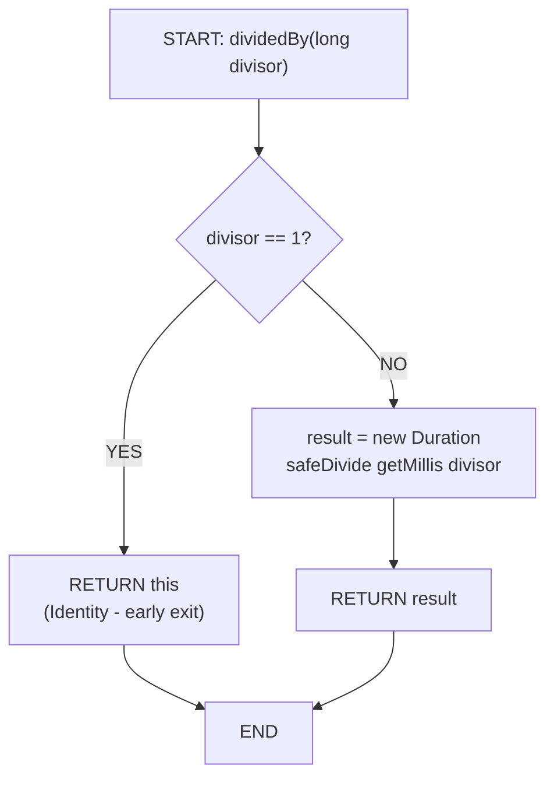

# Duration.dividedBy(long) - Control Flow Graph (CFG)



## CFG Analysis for Duration.dividedBy(long)

### Nodes:
1. **Entry**: Method invocation with parameter `divisor`
2. **Decision**: Check if `divisor == 1` (boundary check)
3. **Branch TRUE**: Return `this` (identity optimization)
4. **Branch FALSE**: Create new Duration with safeDivide result
5. **Exit**: Method returns

### Branches:
- **Path 1 (True)**: `divisor == 1` → Return same instance (no new object created)
- **Path 2 (False)**: `divisor != 1` → Perform division, return new Duration

### Edge Cases & Boundaries:
- **divisor = 1**: Takes fast path (identity)
- **divisor = -1**: Takes division path, negates value
- **divisor = 0**: Division by zero handled by FieldUtils.safeDivide() (throws exception)
- **divisor > 1**: Normal division path
- **divisor < -1**: Division with negative result

### Test Coverage:
- Test 1: `divisor == 1` (true branch)
- Test 2: `divisor == -1` (false branch, negative)
- Test 3: `divisor > 1` (false branch, positive)
- Test 4: `divisor == 0` (exception path)

---

# Duration.dividedBy(long) - Data Flow Graph (DFG)

```
DEFINITIONS:
- D1: divisor parameter
- D2: this.getMillis()
- D3: result of safeDivide(D2, D1)
- D4: new Duration(D3)

USES:
- U1: D1 used in condition (divisor == 1)
- U2: D1 used in safeDivide(D2, D1)
- U3: D3 used to construct Duration
- U4: result returned

DEF-USE CHAINS:
1. D1 → U1 (computational use in comparison)
2. D1 → U2 (computational use in division)
3. D2 → U2 (computational use in division)
4. D3 → U3 (computational use in constructor)
5. D4 → U4 (return value)
```

### Def-Use Pairs:
| Definition | Use | Type | Test |
|-----------|-----|------|------|
| divisor param | divisor == 1 check | Predicate | divisor=1 |
| divisor param | safeDivide parameter | Computational | divisor≠1 cases |
| this.getMillis() | safeDivide parameter | Computational | all cases |
| safeDivide result | Duration constructor | Computational | all cases |
