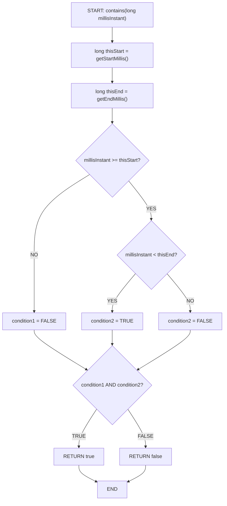

# Interval.contains(long) - Control Flow Graph (CFG)



## CFG Analysis for Interval.contains(long)

### Nodes:
1. **Entry**: Method with `millisInstant` parameter
2. **Initialize**: Get interval boundaries (thisStart, thisEnd)
3. **Decision 1**: Check `millisInstant >= thisStart` (inclusive start)
4. **Decision 2**: Check `millisInstant < thisEnd` (exclusive end)
5. **Decision 3**: Combine both conditions (AND logic)
6. **Exit TRUE**: Return true if both conditions satisfied
7. **Exit FALSE**: Return false otherwise

### Branches (Predicate: millisInstant >= thisStart AND millisInstant < thisEnd):
- **Path 1**: millisInstant < thisStart → FALSE (before start)
- **Path 2**: millisInstant >= thisStart AND millisInstant < thisEnd → TRUE (inside)
- **Path 3**: millisInstant >= thisStart AND millisInstant >= thisEnd → FALSE (after end)

### Edge Cases & Boundaries:
- **millisInstant = thisStart**: TRUE (inclusive start)
- **millisInstant = thisStart - 1**: FALSE (just before start)
- **millisInstant = thisEnd - 1**: TRUE (just before exclusive end)
- **millisInstant = thisEnd**: FALSE (exclusive end)
- **Zero-duration interval** (thisStart == thisEnd): Always FALSE

### Test Coverage:
- Test 1: Before start (path 1)
- Test 2: At start (path 2, true)
- Test 3: In middle (path 2, true)
- Test 4: At end (path 3, false)
- Test 5: After end (path 3, false)
- Test 6: Zero-duration (always false)

---

# Interval.contains(long) - Data Flow Graph (DFG)

```
DEFINITIONS:
- D1: millisInstant parameter
- D2: getStartMillis() result (thisStart)
- D3: getEndMillis() result (thisEnd)
- D4: D1 >= D2 (comparison result)
- D5: D1 < D3 (comparison result)
- D6: D4 AND D5 (conjunction result)

USES:
- U1: D1 used in D4 (millisInstant >= thisStart)
- U2: D2 used in D4 (threshold for lower bound)
- U3: D1 used in D5 (millisInstant < thisEnd)
- U4: D3 used in D5 (threshold for upper bound)
- U5: D4 used in D6 (predicate use)
- U6: D5 used in D6 (predicate use)
- U7: D6 used to determine return value (predicate use)
```

### Def-Use Pairs:
| Definition | Use | Type | Test Case |
|-----------|-----|------|-----------|
| millisInstant param | D1 >= D2 | Computational | all cases |
| thisStart | D1 >= D2 | Computational | all cases |
| millisInstant param | D1 < D3 | Computational | inside/after/before |
| thisEnd | D1 < D3 | Computational | all cases |
| condition1 (D4) | AND condition2 | Predicate | true/false branch |
| condition2 (D5) | AND condition1 | Predicate | true/false branch |
| Final AND result | Return decision | Predicate | return true/false |

### Critical Paths:
1. **millisInstant in [thisStart, thisEnd)**: Both conditions TRUE → return TRUE
2. **millisInstant < thisStart**: First condition FALSE → return FALSE
3. **millisInstant >= thisEnd**: Second condition FALSE → return FALSE
