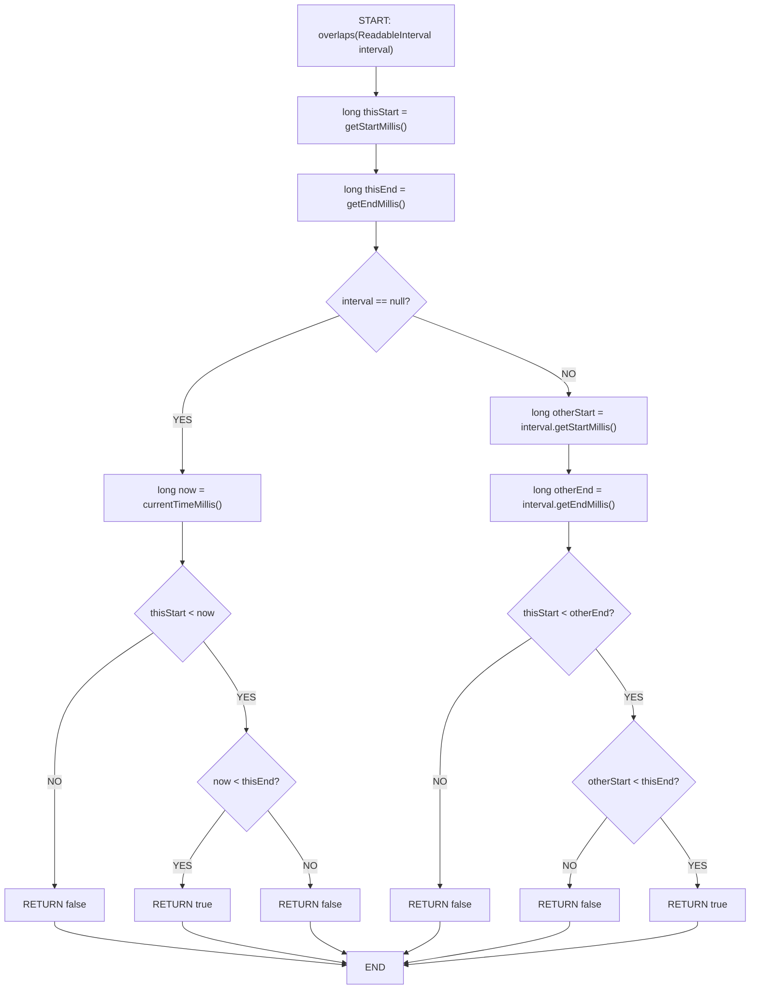

# Interval.overlaps(ReadableInterval) - Control Flow Graph (CFG)



## CFG Analysis for Interval.overlaps(ReadableInterval)

### Nodes:
1. **Entry**: Method with `interval` parameter
2. **Initialize**: Get interval boundaries
3. **NULL Check**: If interval is null, check overlap with "now"
4. **Null Branch**: Compare with current time
   - Decision: thisStart < now?
   - Decision: now < thisEnd?
5. **Non-null Branch**: Get other interval's boundaries
   - Decision: thisStart < otherEnd?
   - Decision: otherStart < thisEnd?
6. **Exit**: Return true/false

### Branches:
- **Path 1 (Null)**: `interval == null` → Check with current time
  - Sub-path 1a: thisStart < now AND now < thisEnd → TRUE
  - Sub-path 1b: Otherwise → FALSE
- **Path 2 (Non-null)**: `interval != null` → Standard overlap check
  - Sub-path 2a: thisStart < otherEnd AND otherStart < thisEnd → TRUE
  - Sub-path 2b: Otherwise → FALSE

### Logic Predicate:
```
Null case:   (thisStart < now) AND (now < thisEnd)
Non-null:    (thisStart < otherEnd) AND (otherStart < thisEnd)
```

### Edge Cases & Boundaries:
- **Abutting intervals** (edge touches): thisEnd == otherStart → FALSE
- **Zero-duration intervals**: Special handling required
- **Null interval**: Uses current time
- **Disjoint intervals**: FALSE
- **Overlapping intervals**: TRUE

### Test Coverage Matrix:
| Test Case | Condition | Expected |
|-----------|-----------|----------|
| Complete overlap | Both AND parts TRUE | true |
| Partial overlap left | Both AND parts TRUE | true |
| Partial overlap right | Both AND parts TRUE | true |
| Abutting before | thisStart < otherEnd but NOT otherStart < thisEnd | false |
| Abutting after | otherStart < thisEnd but NOT thisStart < otherEnd | false |
| Disjoint | Both AND parts FALSE | false |
| One contains other | Both AND parts TRUE | true |
| Equal intervals | Both AND parts TRUE | true |

---

# Interval.overlaps(ReadableInterval) - Data Flow Graph (DFG)

```
NULL CASE (if interval == null):
---------------------------------
DEFINITIONS:
- D1: interval parameter (null)
- D2: getStartMillis() → thisStart
- D3: getEndMillis() → thisEnd
- D4: currentTimeMillis() → now
- D5: thisStart < now (comparison)
- D6: now < thisEnd (comparison)
- D7: D5 AND D6 (conjunction)

USES:
- U1: D2 used in D5 (lower bound comparison)
- U2: D4 used in D5 (comparison value)
- U3: D4 used in D6 (upper bound comparison)
- U4: D3 used in D6 (threshold value)
- U5: D5, D6 used in D7 (predicate conjunction)
- U6: D7 used for return decision

NON-NULL CASE (else):
---------------------
DEFINITIONS:
- D8: interval parameter (non-null)
- D9: getStartMillis() → thisStart (same as D2)
- D10: getEndMillis() → thisEnd (same as D3)
- D11: interval.getStartMillis() → otherStart
- D12: interval.getEndMillis() → otherEnd
- D13: thisStart < otherEnd (comparison)
- D14: otherStart < thisEnd (comparison)
- D15: D13 AND D14 (conjunction)

USES:
- U7: D9 used in D13 (lower bound)
- U8: D12 used in D13 (comparison threshold)
- U9: D11 used in D14 (comparison value)
- U10: D10 used in D14 (threshold)
- U11: D13, D14 used in D15 (predicate conjunction)
- U12: D15 used for return decision
```

### Critical Def-Use Paths:
1. **Null overlap detection**:
   - D2 (thisStart) → D5 (comparison with now) → D7 (AND) → Return
   - D3 (thisEnd) → D6 (comparison with now) → D7 (AND) → Return

2. **Non-null overlap detection**:
   - D9 (thisStart) → D13 (< otherEnd) → D15 (AND) → Return
   - D12 (otherEnd) → D13 (thisStart <) → D15 (AND) → Return
   - D11 (otherStart) → D14 (< thisEnd) → D15 (AND) → Return
   - D10 (thisEnd) → D14 (otherStart <) → D15 (AND) → Return

### Mutation-Sensitive Pairs:
| Operation | Mutation | Impact |
|-----------|----------|--------|
| thisStart < otherEnd | Change to <= | Would include abutting cases |
| otherStart < thisEnd | Change to <= | Would include abutting cases |
| AND operator | Change to OR | Would break logic |
