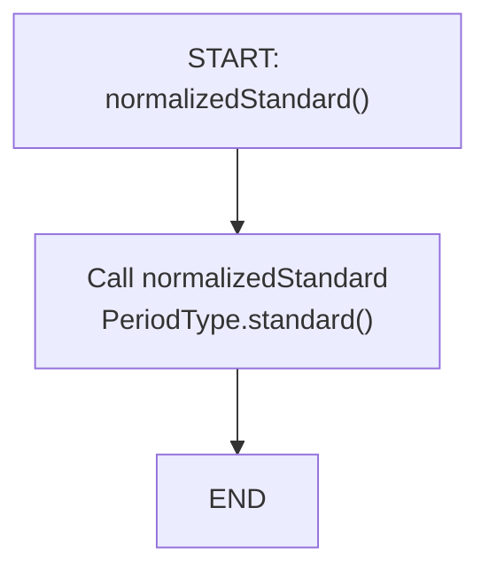
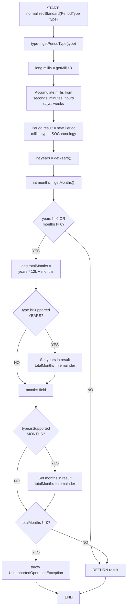

# Period.normalizedStandard() - Control Flow Graph (CFG)



## Simple Flow for normalizedStandard()

This method is a delegation to the parameterized version.

---

# Period.normalizedStandard(PeriodType type) - Control Flow Graph (CFG)



## CFG Analysis for Period.normalizedStandard(PeriodType)

### Nodes:
1. **Entry**: Method with optional type parameter
2. **Initialize**: Get/validate period type, accumulate time components
3. **Create Result**: Build intermediate Period from milliseconds
4. **Check Years/Months**: Determine if normalization needed
5. **Normalize Years**: Split years and months
6. **Normalize Months**: Distribute remaining months
7. **Error Check**: Verify all months accommodated
8. **Exit**: Return normalized period or throw exception

### Branches:
- **Path 1**: No years/months (simple case) → Return directly
- **Path 2**: Has years/months → Normalize both
  - Sub-path 2a: Type supports years → Distribute years
  - Sub-path 2b: Type supports months → Distribute months
  - Sub-path 2c: Leftover months + no field support → Exception

### Key Decision Points:
1. **years != 0 OR months != 0**: Determines if normalization needed
2. **type.isSupported(YEARS_TYPE)**: Controls years normalization
3. **type.isSupported(MONTHS_TYPE)**: Controls months normalization
4. **totalMonths != 0 after distribution**: Validates completeness

### Edge Cases:
- **Already normalized**: All fields within standard ranges
- **Excess time units**: seconds, minutes, hours to be rolled up
- **Excess months (>= 12)**: Converted to years
- **Type constraints**: Some period types don't support all fields
- **Impossible normalization**: Months without year/month field support → Exception

---

# Period.normalizedStandard() - Data Flow Graph (DFG)

```
DEFINITIONS (Simplified - focusing on month normalization):
------------------------------------------------------
- D1: type parameter
- D2: getMillis() result
- D3: Accumulated millis from time fields
- D4: new Period(D3, type, ...) → result
- D5: getYears() result
- D6: getMonths() result
- D7: years != 0 OR months != 0 (predicate)
- D8: D5 * 12 + D6 → totalMonths (compound)
- D9: type.isSupported(YEARS) (predicate)
- D10: computed normalizedYears
- D11: totalMonths - (D10 * 12) (remainder)
- D12: type.isSupported(MONTHS) (predicate)
- D13: computed normalizedMonths (from D11)
- D14: D11 - D13 after months assignment
- D15: D14 != 0 (predicate for exception)

USES:
- U1: D1 used to validate/set type
- U2: D2 used to create intermediate Period
- U3: D3 used in Period construction
- U4: D5 read from Period
- U5: D6 read from Period
- U6: D5, D6 used in D7 (predicate use)
- U7: D5 used in D8 (computational)
- U8: D6 used in D8 (computational)
- U9: D8 used in D11 (computational - if years supported)
- U10: D9 controls branch (predicate use)
- U11: D10 used in D11 (computational)
- U12: D12 controls branch (predicate use)
- U13: D13 used in D14 (computational)
- U14: D14 used in D15 (predicate use)
- U15: D15 used to throw/return (exception pathway)
```

### Critical Def-Use Chains:
1. **Normalization trigger**: D5, D6 → D7 (predicate) → branch decision
2. **Month accumulation**: D5 → D8, D6 → D8 (computational chain)
3. **Years normalization**: D8 → D10 → D11 (if years field supported)
4. **Months normalization**: D11 → D13 → D14 (if months field supported)
5. **Error detection**: D14 → D15 (predicate for exception)

### Mutation-Sensitive Operations:
| Code | Mutation | Impact |
|------|----------|--------|
| years != 0 OR months != 0 | Change to AND | Would skip cases with only years or only months |
| totalMonths = years * 12L + months | Change * to + | Completely wrong calculation |
| totalMonths / 12 | Integer division | Correct for year extraction |
| totalMonths % 12 | Modulo operation | Correct for month remainder |
| type.isSupported(YEARS) | Remove check | Would fail on unsupported types |
| type.isSupported(MONTHS) | Remove check | Would fail on partial support |
| totalMonths != 0 comparison | Change to == | Would throw on valid normalized periods |
